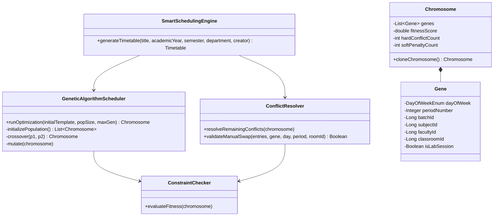

# Backend Architecture Class Diagram

```mermaid
classDiagram
    class SmartSchedulingEngine {
        +generateTimetable(title, academicYear, semester, department, creator) Timetable
    }

    class GeneticAlgorithmScheduler {
        +runOptimization(initialTemplate, popSize, maxGen) Chromosome
        -initializePopulation() List~Chromosome~
        -crossover(p1, p2) Chromosome
        -mutate(chromosome)
    }

    class ConstraintChecker {
        +evaluateFitness(chromosome)
    }

    class ConflictResolver {
        +resolveRemainingConflicts(chromosome)
        +validateManualSwap(entries, gene, day, period, roomId) Boolean
    }

    class Chromosome {
        -List~Gene~ genes
        -double fitnessScore
        -int hardConflictCount
        -int softPenaltyCount
        +cloneChromosome() Chromosome
    }

    class Gene {
        -DayOfWeekEnum dayOfWeek
        -Integer periodNumber
        -Long batchId
        -Long subjectId
        -Long facultyId
        -Long classroomId
        -Boolean isLabSession
    }

    SmartSchedulingEngine --> GeneticAlgorithmScheduler
    SmartSchedulingEngine --> ConflictResolver
    GeneticAlgorithmScheduler --> ConstraintChecker
    ConflictResolver --> ConstraintChecker
    Chromosome *-- Gene
```
