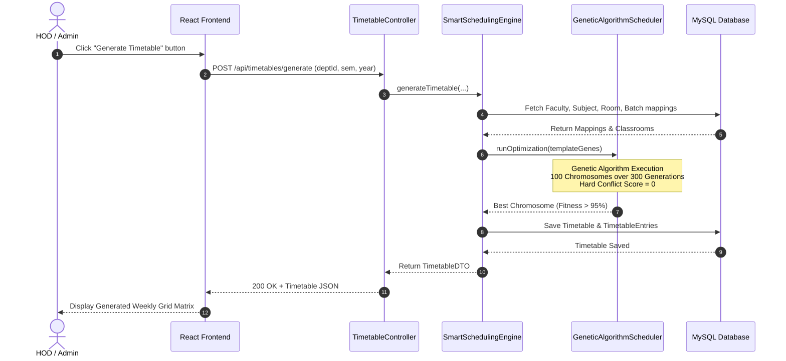
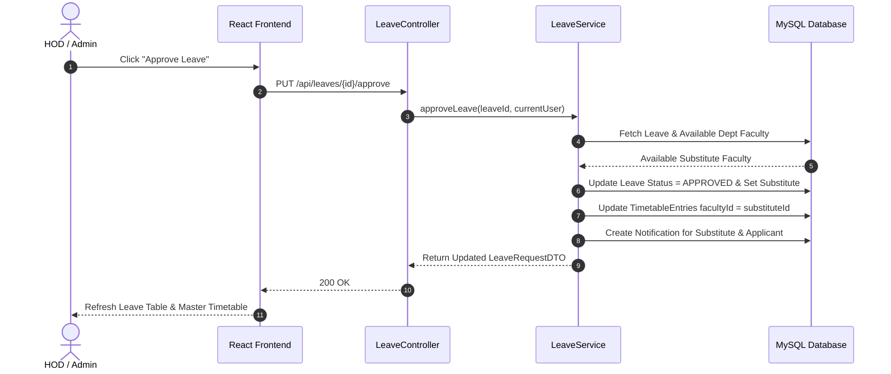

# System Sequence Diagrams

## 1. Automated Timetable Generation Sequence

```mermaid
sequenceDiagram
    autonumber
    actor HOD as HOD / Admin
    participant UI as React Frontend
    participant Ctrl as TimetableController
    participant Engine as SmartSchedulingEngine
    participant GA as GeneticAlgorithmScheduler
    participant DB as MySQL Database

    HOD->>UI: Click "Generate Timetable" button
    UI->>Ctrl: POST /api/timetables/generate (deptId, sem, year)
    Ctrl->>Engine: generateTimetable(...)
    Engine->>DB: Fetch Faculty, Subject, Room, Batch mappings
    DB-->>Engine: Return Mappings & Classrooms
    Engine->>GA: runOptimization(templateGenes)
    Note over GA: Genetic Algorithm Execution<br/>100 Chromosomes over 300 Generations<br/>Hard Conflict Score = 0
    GA-->>Engine: Best Chromosome (Fitness > 95%)
    Engine->>DB: Save Timetable & TimetableEntries
    DB-->>Engine: Timetable Saved
    Engine-->>Ctrl: Return TimetableDTO
    Ctrl-->>UI: 200 OK + Timetable JSON
    UI-->>HOD: Display Generated Weekly Grid Matrix
```

## 2. Faculty Leave Approval & Substitution Sequence

```mermaid
sequenceDiagram
    autonumber
    actor HOD as HOD / Admin
    participant UI as React Frontend
    participant Ctrl as LeaveController
    participant Svc as LeaveService
    participant DB as MySQL Database

    HOD->>UI: Click "Approve Leave"
    UI->>Ctrl: PUT /api/leaves/{id}/approve
    Ctrl->>Svc: approveLeave(leaveId, currentUser)
    Svc->>DB: Fetch Leave & Available Dept Faculty
    DB-->>Svc: Available Substitute Faculty
    Svc->>DB: Update Leave Status = APPROVED & Set Substitute
    Svc->>DB: Update TimetableEntries facultyId = substituteId
    Svc->>DB: Create Notification for Substitute & Applicant
    Svc-->>Ctrl: Return Updated LeaveRequestDTO
    Ctrl-->>UI: 200 OK
    UI-->>HOD: Refresh Leave Table & Master Timetable
```
