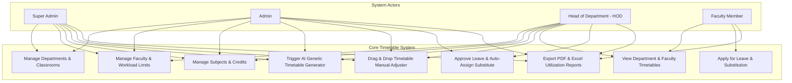

# System Use Case Diagram

```mermaid
graph TD
    subgraph System Actors
        SA[Super Admin]
        AD[Admin]
        HOD[Head of Department - HOD]
        FAC[Faculty Member]
    end

    subgraph Core Timetable System
        UC1[Manage Departments & Classrooms]
        UC2[Manage Faculty & Workload Limits]
        UC3[Manage Subjects & Credits]
        UC4[Trigger AI Genetic Timetable Generator]
        UC5[Drag & Drop Timetable Manual Adjuster]
        UC6[View Department & Faculty Timetables]
        UC7[Apply for Leave & Substitution]
        UC8[Approve Leave & Auto-Assign Substitute]
        UC9[Export PDF & Excel Utilization Reports]
    end

    SA --> UC1
    SA --> UC2
    SA --> UC3
    SA --> UC4
    SA --> UC5
    SA --> UC9

    AD --> UC1
    AD --> UC2
    AD --> UC3
    AD --> UC4
    AD --> UC5
    AD --> UC8
    AD --> UC9

    HOD --> UC2
    HOD --> UC3
    HOD --> UC4
    HOD --> UC5
    HOD --> UC6
    HOD --> UC8
    HOD --> UC9

    FAC --> UC6
    FAC --> UC7
    FAC --> UC9
```
